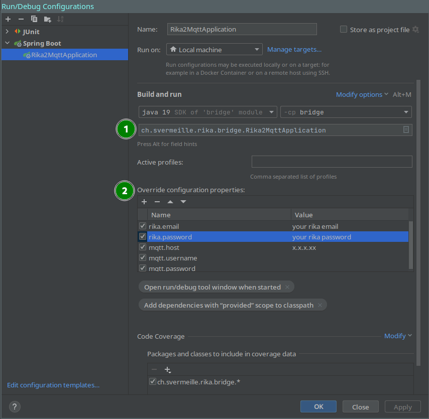

# Developer guide

Stack: https://stackshare.io/rika2mqtt/rika2mqtt#stack

## IDE

Feel free to use the one you prefer: JAVA is IDE agnostic after all :)

This doc will be based on IntelliJ feel free to adapt for your IDE.

Required plugins:

* lombok

## Code style

This project follow google java style guide: https://google.github.io/styleguide/javaguide.html

To ensure the code style is applied, mvn will automatically format the files at each execution.

You can if desired install the auto formatter in your IDE: https://github.com/google/google-java-format/blob/master/README.md#using-the-formatter

## Local run

There is a docker-compose.yml
under `.code/docker-compose`. ([Read more](.code/docker-compose/README.md))
With that you can run a pre configured MQTT server in docker and if desired the docker image of
rika2mqtt.

What I mostly do, is deploy only the mqtt server and run rika2mqtt via the IDE (easier to debug
IMHO).

If you go for it, then you can create a run configuration similar to that:

> info:
> (You can do other ways, the advantage here is that you never risk to publish your credentials by
> accident)

Then you can run the project and enjoy :)

## Makefile is your friend

If you want to run the project in pure CLI there is a `Makefile` available.

You can run:

* `make jar`
* `make test`
* `make docker`

These are a convenient way to invoke some maven commands and bash scripts. But if you are familiar
maven already, feel free to jump directly to maven general commands ;)
