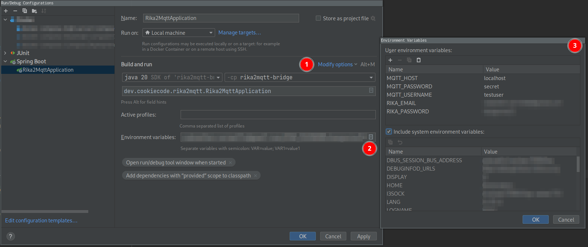

# Developer guide

## IDE
Feel free to use the one you prefer: JAVA is IDE agnostic after all :) 

This doc will be based on IntelliJ feel free to adapt for your IDE.

Required plugins: 
* lombok

## Code style
This project follow google java style guide: https://google.github.io/styleguide/javaguide.html

You can import it directly to your IDE settings

* IntelliJ users: https://google.github.io/styleguide/intellij-java-google-style.xml

## Local run without docker
You will need a running mqtt server + a rika-firenet account.

Then you can create a run configuration similar to that:

> info: 
> (You can do other ways, the advantage here is that you never risk to publish your credentials by accident)

Then you can run the project and enjoy :) 
